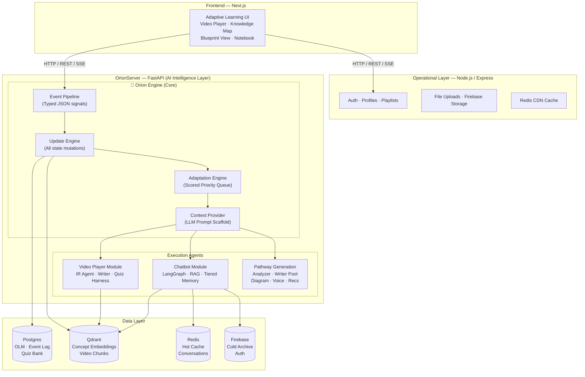
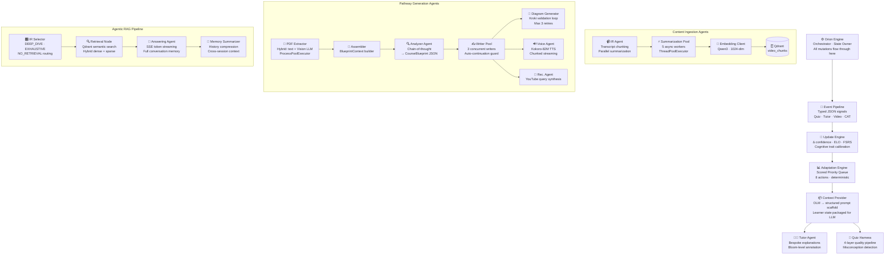

<div align="center">

# 🎓 Gradus

**AI-Native Adaptive Learning Engine**

*Closed-loop cognitive modeling with concept-level granularity, autonomous multi-agent orchestration, and deterministic adaptation — not an LLM wrapper.*

[](https://polyformproject.org/licenses/noncommercial/1.0.0)
[](https://www.python.org/downloads/)
[](https://fastapi.tiangolo.com/)
[](https://langchain-ai.github.io/langgraph/)
[](https://nextjs.org/)
[](https://qdrant.tech/)

</div>

> **Scope & Authorship:** The entire AI intelligence layer — OrionServer, the Orion Engine, all execution agents, the Orion Learner Model, the quiz harness, and all agentic infrastructure — was **designed and built entirely solo**. The Node.js operational layer and Next.js frontend appear in architecture diagrams for system context only.

---

## 📖 Overview

Traditional online learning platforms treat every learner the same. Whether someone is a fast learner, struggles with prerequisites, prefers visual explanations, or learns best through practice — the content remains static. This leads to information overload, poor retention, low engagement, and fragmented experiences scattered across multiple platforms.

**Gradus** is an AI-native adaptive learning platform. At its core is **Orion** — a continuously running, closed-loop AI engine that models learner understanding at concept-level granularity, infers cognitive patterns from structured interaction signals, and acts on this model to dynamically reshape every subsequent learning experience. Every quiz answer, tutor interaction, and engagement signal updates a living learner model — which in turn immediately changes what the learner sees next.

> **This is not a chatbot. Not a recommendation engine. Not an LLM wrapper.**
>
> Orion is a fully **stateful, event-driven Learner State Machine** — a multi-agent system where LLMs are tools invoked by a deterministic orchestrator, not the decision-makers. The orchestrator decides *what* action to take (deterministically, from formulas over learner state). The LLM decides *how* to execute that action (flexibly, from structured prompt scaffolding). This separation is the core architectural principle.

### What Makes This Different

| Traditional EdTech | Gradus / Orion |
|---|---|
| LLM generates a response from a prompt | LLM is a downstream executor; a **scored priority queue** selects the action first |
| Content is the same for all users | Content is selected, sequenced, and generated per-learner from a **5-layer cognitive model** |
| User profile = a list of completed courses | User profile = a **per-concept knowledge DAG** with confidence scores, mastery tiers, memory decay curves, and cognitive trait multipliers |
| "Adaptive" = skip questions you got right | Adaptive = **8 deterministic adaptation actions** scored by formulas over live learner state, including prerequisite backtracks, spaced review triggers, difficulty scaling, and style rotation |
| Quiz = generic MCQ bank | Quiz = **4-layer generation harness** with concept mapping, independent LLM validation, confidence-weighted signal extraction, and statistical self-improvement |
| Memory = conversation history | Memory = **tiered hot/warm/cold architecture** (Redis → Qdrant → Firestore) with dense summarization for cross-session context |

---

## 🏗️ System Architecture



Gradus is composed of three independently deployable services. The intelligence layer (OrionServer) is the system's brain — everything else serves it.

**Key architectural decision:** The Orion Engine is the single owner of all learner state. No execution agent, no frontend component, and no external service writes to learner state directly. Every state mutation flows through the **Event Pipeline** as a typed, versioned JSON event — processed by the **Update Engine** — which guarantees auditability, replayability, and a single source of truth.

---

## 🤖 The Orion Agent System

OrionServer is an autonomous, **hierarchical multi-agent system** with a clear separation between orchestration and execution:

- **Orchestration Level** — Orion Engine, Adaptation Engine, Context Provider. These are deterministic, formula-driven, and fully explainable. They decide *what happens next*.
- **Execution Level** — Specialized agents (Tutor, Writer, Quiz, IR, etc.) invoked by the orchestrator. These use LLMs for flexible content generation. They decide *how it happens*.

This is the critical distinction: **the LLM never decides what action to take. A deterministic priority queue does.** The LLM is a downstream tool, not the decision-maker. Every execution agent operates inside a **self-correction loop** — generating output, validating it against domain-specific criteria, and retrying with error feedback when validation fails. Each loop is bounded by a **circuit breaker** (max retry count + token budget) to prevent runaway cost and infinite loops.



### Agent Roster

| Agent | Responsibility | Key Engineering Decision |
|---|---|---|
| **Orion Engine** | Central orchestrator — owns all learner state mutations | Single-writer architecture: all state flows through typed events. No agent writes directly to DB. |
| **Adaptation Engine** | Evaluates 8 adaptation actions, executes the highest-scoring one | Fully deterministic — every decision traceable to a formula, a weight, and a signal source. |
| **Context Provider** | Packages the full OLM (5 layers) into a structured LLM prompt scaffold | Clean separation: deterministic logic decides *what*, LLM decides *how*. |
| **Tutor Agent** | Generates bespoke explanations from scaffold; annotates each user message | Classifies every utterance for Bloom's taxonomy level + confusion signal before responding — feeding structured events back into Orion. |
| **IR Agent** | Chunks video transcripts into ~5-min windows; orchestrates parallel summarization | **Cache-first**: checks Qdrant for existing chunks before triggering any reprocessing. Uses `ThreadPoolExecutor` for I/O-bound LLM calls. |
| **Summarization Pool** | 5 async workers; each chunk → `index_text` (searchable) + `summary_text` (context) | Fire-and-forget async storage after embedding — non-blocking response path. |
| **Quiz Harness** | 4-layer quality pipeline: generation → validation → confidence tap → statistical calibration | Layer 2 uses the **LLM-as-a-Judge** pattern — an independent second LLM validates each question. No self-grading. |
| **IR Selector** | Routes each query to `DEEP_DIVE`, `EXHAUSTIVE`, or `NO_RETRIEVAL` — the core of the **Agentic RAG** pattern | An LLM agent decides *if and how* to retrieve, preventing context window bloat. Casual questions skip retrieval entirely. |
| **Answering Agent** | RAG-powered response with SSE token-by-token streaming | Full conversation memory via tiered Redis → Qdrant → Firestore storage. |
| **Memory Summarizer** | Compresses long conversation history into dense summaries | Preserves cross-session context without ballooning prompt token count. Triggered when conversation exceeds threshold length. |
| **Analyzer Agent** | Ingests multi-source materials → structured `CourseBlueprint` JSON (5–10 modules) | **Self-correction loop**: chain-of-thought prompting → JSON parse → if malformed, error fed back to LLM for retry. **Circuit breaker**: max 3 attempts. |
| **Writer Pool** | 3 concurrent `WriterAgent` instances; each produces a deep-dive module chapter | **Auto-continuation loop**: detects `finish_reason=length` → sends structured continuation with prior context. **Circuit breaker**: max 5 passes. |
| **Diagram Generator** | Generates Mermaid/PlantUML/Graphviz/D2 diagram code via LLM, validates via Kroki API | **Self-correction loop**: sanitize LLM output → render against Kroki → if error, feed error back to LLM for regeneration. **Circuit breaker**: max 3×. |
| **Vision Client** | Extracts semantic context from images inside PDFs using multimodal LLM | Runs inside `ProcessPoolExecutor` during parallel PDF batch processing — CPU-bound image preprocessing offloaded from async event loop. |
| **Voice Agent** | Converts learning modules to audio via Kokoro-82M TTS | Chunked byte streaming with configurable voice, speed, and format. |
| **Recommendation Agent** | Synthesizes YouTube-optimized search queries per topic from learner's knowledge frontier | Uses the EDCV (learner's concept centroid) to weight topic relevance. Randomized API key pool for throughput. |

---

## 🧠 The Orion Learner Model (OLM)

The OLM is the living, per-learner data structure that Orion continuously reads and writes. It is not a user profile — it is a **multi-dimensional cognitive state machine** that models what the learner knows, how they learn, how fast they forget, and what they prefer. It consists of 5 active layers:

| Layer | Name | What It Models |
|---|---|---|
| **1** | Concept Knowledge Map | Per-concept confidence, mastery tier, FSRS stability & retrievability |
| **2** | Cognitive Trait Profile | Personal multipliers — forgetting rate, learning velocity, transfer efficiency |
| **3** | Subject Ability Rating (ELO) | Competency scalar per subject, updated on every graded quiz event |
| **4** | Preference Profile | Instructional style weights, pacing, content density — time-decayed from behavior |
| **5** | Subject Memory (FSRS) | Forgetting curve per subject — drives automated spaced review triggers |

```
OrionLearnerModel(user_id):
│
├── [Layer 1] Concept Knowledge Map
│     Per-concept diagnostic state — the finest-grained knowledge representation.
│     concept_knowledge[concept_id]:
│       confidence:         float [0.05 → 0.99]     # Clamped — never 0, never 1
│       mastery_tier:       NONE | SURFACE | APPLIED | INTEGRATED
│       stability:          float (days)             # FSRS: memory half-life
│       retrievability:     float [0.0 → 1.0]       # FSRS: P(recall right now)
│       signal_count:       int                      # Evidence density
│
├── [Layer 2] Cognitive Trait Profile
│     Personalized multipliers — start at population defaults (1.0), calibrate from evidence.
│     forgetting_rate:       float [0.4 → 2.5]       # > 1.0 = forgets faster than average
│     transfer_efficiency:   float [0.3 → 3.0]       # > 1.0 = leverages prerequisites well
│     learning_velocity:     float [0.3 → 3.0]       # > 1.0 = reaches mastery faster
│     trait_confidence:      VOLATILE | CALIBRATING | STABLE
│
├── [Layer 3] Subject Ability Rating (ELO)
│     Per-subject competency scalar — updated on every graded quiz event.
│     rating:               float [800 → 2200]       # Dynamic K-factor (48→32→16)
│
├── [Layer 4] Preference Profile
│     Time-decayed instructional style preferences — updated from behavior.
│     conceptual_vs_applied: float [0.0 → 1.0]
│     pacing_preference:     SLOW | MODERATE | FAST
│     content_density:       LIGHT | BALANCED | DENSE
│     instructional_strategy_weights: Dict[strategy → weight]
│
└── [Layer 5] Subject Memory (FSRS)
      Forgetting curve per subject — determines when spaced review triggers.
      stability:            float (days)
      retrievability:       R(t) = 0.9^(t/S)         # Computed on-demand, not stored
      When R(t) < 0.70 → trigger spaced review action
```

### The Signal-to-State Pipeline (Closed-Loop Engineering)

Orion operates as a **closed-loop system** — the defining pattern of **loop engineering**. Every learner interaction generates a signal, the signal mutates the learner model, the updated model rescores all possible actions, and the highest-scoring action reshapes the next interaction. This Observe → Update → Decide → Act → Observe cycle runs continuously with no manual intervention. No component writes to learner state directly — all mutations flow through the Event Pipeline as typed, versioned JSON events:

```
Signal Sources
  ├── Quiz Submission     → concept confidence Δ · ELO update · misconception classification
  ├── Tutor Interaction   → Bloom-level annotation · confusion signal · recall confirmation
  ├── Onboarding CAT      → initial ELO calibration · preference seeding · concept priors
  ├── Recommendation Fbk  → preference drift detection (3× ignored → recalibrate)
  └── Video Behavioral    → rewind at concept timestamp · speed changes · session abandonment
```

**Signal richness over signal volume.** A single quiz question captures 7 structured fields:

```
  ✓ correct (boolean)
  ✓ mastery_tier tested (SURFACE / APPLIED / INTEGRATED)
  ✓ self_reported_confidence (GUESSED / SOMEWHAT / CONFIDENT)
  ✓ time_taken_ms
  ✓ answer_changed direction (CORRECT_TO_WRONG = anxiety signal)
  ✓ is_misconception_distractor (true → Orion knows which misconception)
  ✓ misconception_type (SCOPE_CONFUSION / METRIC_ERROR / BASIC_MISCONCEPTION)
```

All confidence deltas are calculated as: `base_delta × learner_multiplier(cognitive_traits) × confidence_modifier`. A correct answer from a learner who selected `GUESSED` gets its positive delta halved. A wrong answer from a learner who selected `CONFIDENT` gets its negative delta increased by 30% — because a firm, confident wrong answer is a strong misconception signal, not just a mistake.

### Concept-Level Knowledge Graph

Content is not tracked at the video or topic level. Orion models knowledge at the **Concept** level — the smallest independently testable unit of knowledge. Each concept lives in a **Directed Acyclic Graph (DAG)** encoding prerequisite relationships.

This graph powers:
- **Outer Fringe Calculation** — the set of concepts the learner is cognitively ready to learn right now (all prerequisites ≥0.65 confidence and ≥0.50 retrievability)
- **Prerequisite Backtracks** — when a learner struggles, Orion checks whether the issue is actually an unmet prerequisite, not the concept itself
- **Concept Deduplication** — new concepts extracted from video ingestion are resolved against the existing graph via cosine similarity. ≥0.92 → aliased, 0.75–0.92 → child node with prerequisite edge, <0.75 → new concept

### Cognitive Trait Personalization

Every learner starts from population defaults `(1.0, 1.0, 1.0)`. Three cognitive traits evolve independently from behavioral evidence:

| Trait | What It Measures | How It Calibrates |
|---|---|---|
| **forgetting_rate** | How fast does this learner lose recall? | Predicted FSRS retrievability vs. actual quiz score at review time. Divergence > 15% triggers adjustment. |
| **learning_velocity** | How quickly do they reach concept mastery? | Events needed to cross the SURFACE confidence threshold. Population average: 4 events. <3 → faster, >6 → slower. |
| **transfer_efficiency** | Do they leverage prerequisite knowledge? | First-attempt correctness on new concepts when prerequisites are strongly mastered (≥0.75 confidence). |

Traits don't activate immediately. While `trait_confidence = VOLATILE` (< 5 graded interactions), the engine uses population defaults. During `CALIBRATING` (5–15), partial personalization. Only at `STABLE` (>15) do traits fully drive adaptation. This prevents over-correction from sparse early data.

### Memory Modeling (FSRS)

Orion applies the **FSRS** (Free Spaced Repetition Scheduler) algorithm at the subject level to model forgetting curves:

```
Retrievability R(t) = 0.9^(t / S)

Where S = stability (days until P(recall) drops below 90%)
      t = days since last review

Successful review → S grows:  S_new = S_old × (1 + 0.1 × e^(-0.05 × D) × transfer_efficiency)
Failed review     → S drops:  S_new = S_old × 0.5 × e^(-0.1 × D) × (1 / forgetting_rate)

When R(t) < 0.70 → Adaptation Engine triggers spaced review (highest urgency)
```

Stability personalizes per learner — `transfer_efficiency` amplifies consolidation gains, `forgetting_rate` amplifies decay penalties. The system doesn't just track what you know — it predicts when you'll forget it.

### Cold Start: The Warm-Up Pipeline

New learners don't enter cold. A 2-step warm-up initializes the OLM before the first video:

**Step 1 — Placement Survey (2 min, unscored)**
Maps self-reported experience, learning goals, explanation preferences, and pacing directly to OLM initial values:
- `ADVANCED` prior experience → Subject ELO initialized at 1700 (not default 1500)
- `EXAMPLE_FIRST` preference → `conceptual_vs_applied = 0.2` (applied bias)
- `CERTIFICATION` goal → preference weight boosted for `APPLIED + INTEGRATED` tier content

**Step 2 — Computerized Adaptive Test (5–8 questions, ~5 min)**
A dynamically difficulty-adjusted diagnostic quiz:
- Each correct answer → escalates difficulty, seeds 1–2 concept confidence values at 0.3–0.5
- Each wrong answer → drops difficulty, seeds concept values at 0.0–0.2
- Terminates when ELO estimate has **converged** (variance < 80 points across last 3 estimates) or 8 questions answered

After the CAT, the learner enters their first video with a calibrated ability rating and a partial concept map — not a blank slate.

---

## 🔄 The Collaborative Flywheel

As the platform's user base grows, cold-start quality improves automatically. This is not a feature — it's an emergent property of the architecture:

| Stage | Scale | Prior Mechanism |
|---|---|---|
| **Stage 1: Global Defaults** | 0–100 learners | All new learners start with population-average trait values `(1.0, 1.0, 1.0)` |
| **Stage 2: Cohort Segmentation** | 100–1000 learners | Learners segmented by onboarding signals. Each cohort computes average traits. New learners inherit their matched cohort's averages. |
| **Stage 3: Collaborative Filtering** | 1000+ learners | After 3–5 interactions, compute partial concept signature → find 50 nearest existing learners by OLM similarity → their average traits become this learner's priors. |

The platform gets smarter at initializing new learners with every learner who uses it. Learners who join later benefit from all prior learning history on the platform. This is the **flywheel** — the system's predictive power compounds with scale.

---

## ⚙️ Adaptation Engine: Scored Priority Queue

The Adaptation Engine is the decision layer. It evaluates **8 possible adaptation actions** every time the learner's state updates and executes the highest-scoring one. This is a **deterministic, auditable, weight-configurable priority queue** — not a neural network, not a black box.

| Priority | Action | When It Fires | Default Weight |
|---|---|---|---|
| 1 | `serve_prerequisite` | Unmet dependency blocking current concept | **w = 1.6** (highest — structural gaps block everything downstream) |
| 2 | `serve_spaced_review` | Subject retrievability R(t) below forgetting threshold | **w = 1.4** (forgetting is irreversible without intervention) |
| 3 | `reduce_difficulty` | Learner ELO significantly below content difficulty (R_u < R_v - 300) | **w = 1.3** (frustration must be addressed quickly) |
| 4 | `serve_micro_quiz` | Concept confidence low, not tested recently | **w = 1.1** (targeted assessment on weakest concept) |
| 5 | `serve_next_concept` | Current concept mastered, outer fringe has candidates | **w = 1.0** (forward progress) |
| 6 | `escalate_difficulty` | Learner ELO significantly above content difficulty (R_u > R_v + 200) | **w = 0.9** (quality-of-life, not urgent) |
| 7 | `serve_alternative_style` | Same concept hit 2+ times with declining confidence + style mismatch | **w = 0.8** (try different explanation approach) |
| 8 | `trigger_tutor_nudge` | Low engagement or approaching spaced review threshold | **w = 0.7** (fallback when nothing else is more urgent) |

**Every decision is explainable.** After the priority queue selects an action, the **Context Provider** packages the full OLM state into a structured prompt scaffold — including the learner's ability level, preference profile, detected misconceptions, and the reason for the action — and hands it to the Tutor LLM. The LLM generates a bespoke response, but Orion always controls *what type* of response is generated.

Every action also generates a **human-readable reason string** shown to the learner: *"You haven't practiced Algorithms in a while — let's make sure it sticks"* or *"Before diving into Dynamic Programming, let's strengthen your understanding of Recursion."* No silent, unexplained decisions.

---

## 🎯 Quiz Generation Harness

Quizzes are the **primary signal source** in the system. Their quality determines the quality of every learner state update downstream. Bad quiz questions corrupt the entire learner model. This is a textbook case of **harness engineering** — building the systematic infrastructure around LLM output that transforms unreliable generation into production-grade quality. The harness enforces correctness through a 4-layer quality pipeline — not a single LLM call:

### Layer 1 — Concept-Mapped, Tier-Tagged Generation
Every question is generated for a **specific concept** at a **specific mastery tier** (SURFACE / APPLIED / INTEGRATED). Distractors are explicitly typed by misconception category:
- `SCOPE_CONFUSION` — confuses this concept with an adjacent one
- `METRIC_ERROR` — correct concept, wrong quantitative detail
- `BASIC_MISCONCEPTION` — a common beginner misunderstanding

When a learner selects a typed distractor, Orion knows *which specific misconception they hold* — not just that they got it wrong.

### Layer 2 — Independent LLM Validation (LLM-as-a-Judge)
A **second, separate LLM call** reviews each generated question against 5 criteria: single unambiguous correct answer, plausible distractors, mastery tier alignment, source answerability, no trick phrasing. This implements the **LLM-as-a-Judge** pattern — a dedicated evaluator agent scores the primary agent's output against a strict rubric before it enters the system. Questions that fail are auto-corrected or discarded. Circuit breaker: max 3 retries per question.

This is critical: **the generator LLM does not validate its own output.** Validation is an independent pass — the same principle used in production evaluation harnesses across the industry.

### Layer 3 — Self-Reported Confidence Tap
After each answer: *"How confident were you?"* → `Just guessed / Somewhat confident / Very confident`. This single field transforms signal quality:
- Correct + `GUESSED` → delta halved (unreliable signal — lucky guess)
- Wrong + `CONFIDENT` → delta increased 30% (firm misconception — worse than a careless error)

### Layer 4 — Statistical Calibration & Question Quarantine
After ≥20 real learner responses accumulate per question:
- Correct rate > 92% → flagged as mis-tiered (too easy for its stated tier)
- Correct rate < 15% → **quarantined** (likely ambiguous, broken, or wrong answer key)
- Any single distractor chosen > 45% → flagged for distractor ambiguity

Quarantined questions are automatically excluded from future generation. This creates a **self-improving question bank** — quality increases with usage. The quiz system has an immune system.

---

## 📐 Architectural Invariants

These are binding constraints — not aspirational guidelines. Every one is enforced structurally, not by convention:

1. **Deterministic Over Opaque.** Every adaptation action is traceable to a formula, a signal, and a weight. No black-box neural networks in the decision loop. LLMs generate content; they don't make decisions.

2. **Orion Owns All State Mutations.** No external component — not the tutor, not the quiz engine, not the frontend — writes to learner state directly. All state changes flow through the Event Pipeline as typed events. This guarantees auditability, replayability, and a single source of truth.

3. **Signal Richness Over Signal Volume.** A single well-constructed distractor-typed quiz question with confidence reporting is worth more than 5 plain correct/wrong signals. System design optimizes for informational density per interaction, not interaction count.

4. **Dynamic Over Hardcoded.** All delta values are `base_delta × learner_multiplier`. Base deltas are population defaults. Learner multipliers evolve from evidence. Every formula parameter is configurable. Nothing is permanently hardcoded.

5. **Memory Has Decay.** All knowledge states decay over time via FSRS retrievability. The system models forgetting, not just learning. Knowledge that isn't reinforced disappears — and Orion anticipates that.

6. **Cold Start Is Not An Excuse.** The 2-step warm-up (survey + adaptive CAT) eliminates true cold starts. Every learner enters the system with a calibrated initial state. As the platform scales, collaborative filtering makes cold starts increasingly accurate.

7. **The Quiz Harness Is The System's Immune System.** Bad quiz questions corrupt the entire learner model — every downstream confidence score, ELO update, and adaptation decision. Quality defenses (all 4 layers) are non-optional infrastructure, not nice-to-haves.

---

## 🛡️ Harness Engineering & Guardrails

**Harness engineering** is the discipline of building everything *around* the LLM that makes it production-safe — the validation layers, the **circuit breakers**, the **self-correction loops**, and the architectural constraints that prevent any single agent failure from corrupting the system. In Gradus, guardrails operate at three levels: **input constraints** (what signals enter the system), **output validation** (what the LLM produces before it reaches the learner), and **architectural invariants** (what the system structurally cannot do, regardless of what the LLM decides).

| Guardrail | Mechanism | Level |
|---|---|---|
| **Single-Writer State Architecture** | Only the Orion Update Engine writes learner state. All agents emit events; Orion processes them. No direct DB writes from agent code. Event replay is possible for debugging. | Architectural |
| **Confidence Clamping** | All concept confidence values clamped to `[0.05, 0.99]`. Floor at 0.05 prevents a concept from becoming unrecoverable. Ceiling at 0.99 ensures assessment always has stakes. | Architectural |
| **Concept Deduplication Pipeline** | Cosine similarity ≥0.92 before a new concept node is created. Near-duplicates are aliased, not cloned. Sub-specializations (0.75–0.92) create child nodes with prerequisite edges + 50% confidence inheritance. | Input |
| **Edge Deprecation (Not Deletion)** | Prerequisite edges are never hard-deleted — marked `deprecated=true`. Behavioral evidence can deprecate edges (≥100 learners mastered child without parent). Seed edges are never auto-deprecated. Full audit trail. | Architectural |
| **Trait Confidence Gate** | Cognitive traits are locked to `VOLATILE` until ≥5 graded interactions. During `VOLATILE`, population defaults drive adaptation — preventing over-correction from sparse early data. | Input |
| **Quiz Quarantine** | Statistically misbehaving questions are auto-excluded from quiz rotation. Self-improving question bank — bad questions are caught and removed without human intervention. | Output |
| **Diagram Self-Correction Loop** | Diagram Generator validates all LLM-generated diagram code against the Kroki API before returning. Bad syntax → error fed back to LLM for regeneration. **Circuit breaker**: max 3 attempts before graceful failure. | Output |
| **Writer Continuation Guard** | Writer Agent detects `finish_reason=length` and sends structured continuation requests with prior context. **Circuit breaker**: max 5 continuation passes — prevents truncated learning modules. | Output |
| **IR Cache-First** | IR Agent checks Qdrant for existing video chunks before triggering reprocessing — prevents redundant LLM calls and duplicate embeddings for already-analyzed content. | Input |
| **LLM Prompt Isolation** | The OLM prompt scaffold built by the Context Provider is never surfaced to the learner. The Tutor LLM is instructed to respond as an expert tutor, not reveal its scaffolding structure. | Architectural |
| **Mastery Tier Hysteresis** | A learner doesn't reach a mastery tier on a single quiz pass. Tier transitions require confidence above threshold for **2+ consecutive** graded interactions — preventing noise-driven promotions. | Output |

---

## 🗄️ Data Architecture

### Tiered Storage Design

The data layer is organized by **access pattern and latency requirements**, not by technology preference:

| Tier | Store | What Lives Here | Why This Tier |
|---|---|---|---|
| **Structured State** | **Postgres** | OLM tables (concept states, ELO, FSRS, cognitive traits, preferences), event log, quiz question bank | Relational queries on learner state: "all concepts where confidence < 0.4 for user X in subject Y". Transactions for atomic OLM updates. |
| **Vector Search** | **Qdrant** | Concept node embeddings (deduplication + EDCV search), video chunk embeddings (RAG retrieval), warm conversation history | Semantic similarity: "find content closest to this learner's knowledge frontier". Hybrid dense + sparse retrieval for RAG. |
| **Hot Cache** | **Redis** | Active conversation history, CDN response cache, session state | Sub-ms latency for in-flight conversations. Tutor needs last 10 messages instantly, not from a database round-trip. |
| **Cold Archive** | **Firebase Firestore** | Long-term conversation archive, user auth state | Permanent storage for conversations that have aged out of Redis and Qdrant. Cost-efficient at scale. |

### Content Recommendation: The EDCV Vector

When Orion needs to find new content for a learner, it computes the **Effective Developmental Zone Content Vector (EDCV)** on demand:

```
EDCV = weighted_centroid(
    top_10_concepts by (confidence × time_decay(last_signal_at, half_life=30 days))
)

→ Query Qdrant video_chunks collection
→ Return content whose semantic centroid is closest to the learner's
  current knowledge frontier — not their history, their frontier.
```

The EDCV is **not stored** — it is computed lazily per recommendation call. This ensures recommendations always reflect the learner's most current state, not a stale snapshot.

### Concurrency Model

OrionServer uses a **dual-executor architecture** to separate CPU-bound and I/O-bound workloads:

| Workload | Executor | Example |
|---|---|---|
| **CPU-bound** | `ProcessPoolExecutor` (5 workers) | PDF page extraction, image preprocessing with OpenCV, embedding batch computation |
| **I/O-bound** | `ThreadPoolExecutor` (5 workers) | LLM API calls, Qdrant reads/writes, Kroki diagram validation |
| **Async event loop** | `asyncio` (FastAPI native) | HTTP request handling, SSE streaming, Redis operations |

This prevents CPU-heavy PDF extraction from blocking the async event loop, and prevents I/O-heavy LLM calls from starving CPU tasks. Resource lifecycle is managed by FastAPI's `lifespan` context manager — all pools are initialized at startup and gracefully drained at shutdown via a singleton pattern.

---

## 🛠️ Technology Stack

### OrionServer (Python — AI Intelligence Layer)
| Technology | Role |
|---|---|
| **FastAPI** | Async API server with SSE streaming, lifespan resource management |
| **LangGraph** | Stateful multi-node agent workflows (RAG chat pipeline) |
| **Qdrant** | Vector database — concept embeddings, video chunk retrieval, hybrid search |
| **Postgres** | Structured learner state (OLM), event log, quiz bank |
| **DeepInfra** | LLM inference provider — Llama 3.3 (70B), Llama 3.1 |
| **Qwen3-Embedding-0.6B** | Text embeddings — 1024 dimensions |
| **Kokoro-82M** | Text-to-speech for Voice Agent |
| **pymupdf4llm / PyMuPDF** | Hybrid PDF extraction — text/tables + image coordinates |
| **OpenCV / NumPy** | Image quality heuristics for PDF diagram filtering |
| **Kroki API** | Diagram rendering + validation (Mermaid, PlantUML, Graphviz, D2) |
| **Redis** | Hot-tier conversation cache, session state |
| **Firebase Firestore** | Cold-tier conversation archive |
| **httpx** | Async HTTP/2 client for all external API calls |

### Node.js Backend (Operational Layer) *(team-built — shown for architectural context)*
| Technology | Role |
|---|---|
| **Express.js** | REST API server |
| **Firebase Admin SDK** | Auth verification, Firestore operations |
| **youtube-sr** | YouTube metadata and search |
| **Redis** | Response caching |
| **Multer** | File upload handling |

### Frontend (Next.js) *(team-built — shown for architectural context)*
| Technology | Role |
|---|---|
| **Next.js 15 / React 19** | Core UI framework with App Router |
| **Tailwind CSS v4** | Styling system |
| **Redux Toolkit + redux-persist** | Global state management with persistence |
| **Motion (Framer)** | Animations and transitions |
| **better-react-mathjax** | Math equation rendering (LaTeX) |

---

## 📁 Repository Structure

```
Gradus_Public/
├── Frontend/                    # Next.js web application
│   ├── src/
│   │   ├── app/                 # Next.js App Router pages
│   │   └── Components/          # Atomic component library
│   └── store/                   # Redux slices & persistence config
│
├── Backend/                     # Node.js / Express operational API
│   ├── Routes/                  # Feature-specific route handlers
│   ├── useRouter/               # Central router aggregator
│   ├── utils/                   # Shared utilities
│   └── firebase.js              # Firebase Admin initialization
│
└── Python backend/              # FastAPI AI server (OrionServer)
    └── OrionServer/
        ├── unified_server.py    # FastAPI entry point & lifespan manager
        ├── core/
        │   ├── config.py        # Environment & settings
        │   ├── lifespan.py      # Startup/shutdown · resource pool lifecycle
        │   ├── prompt_cache.py  # Centralized LLM prompt registry
        │   └── logging_config.py # Tiered JSON structured logging
        ├── modules/
        │   ├── video_player/    # Video analysis & content generation
        │   │   ├── ir_agent.py              # Transcript chunking orchestrator
        │   │   ├── writer_agent.py          # Long-form content generator
        │   │   ├── quiz_generator.py        # 4-layer quiz harness
        │   │   ├── recommendation_agent.py  # EDCV-based video recommendations
        │   │   └── Chunking_Embedding_Processor/
        │   │       ├── unified_storage.py       # Qdrant chunk storage
        │   │       ├── summarization_worker.py  # 5-worker async pool
        │   │       └── user_profile_storage.py  # Learner history tracking
        │   └── chatbot/         # RAG chatbot & tiered conversation memory
        │       ├── chatbot.py               # LangGraph workflow definition
        │       ├── router.py                # Chat API endpoints
        │       ├── chatbot_utils/           # IR selector · answering · vision · memory
        │       └── Storage/                 # Redis → Qdrant → Firebase tiered storage
        └── utils/               # Shared Qdrant client singleton
```

*`Frontend/` and `Backend/` are team-built components included for full-system context. The AI intelligence layer (`Python backend/OrionServer/`) was designed and built entirely solo.*

---

## 📄 License

This project is licensed under the **PolyForm NonCommercial License 1.0.0**.

- ✅ Free for personal use, research, education, and non-commercial projects
- ✅ Academic institutions and public research organizations
- ❌ Commercial use, SaaS products, or offering this as a managed service

See the [LICENSE](LICENSE) file for full terms, or read the [PolyForm NonCommercial summary](https://polyformproject.org/licenses/noncommercial/1.0.0).
